# Technical Architecture Diagrams
## AI-Powered Multi-Tenant School Management Platform

**Version:** 1.0  
**Date:** January 19, 2026

---

## Architecture Overview

This document contains Mermaid diagrams that can be rendered in GitHub, VS Code, or any Mermaid-compatible viewer.

---

## 1. System Architecture (High-Level)

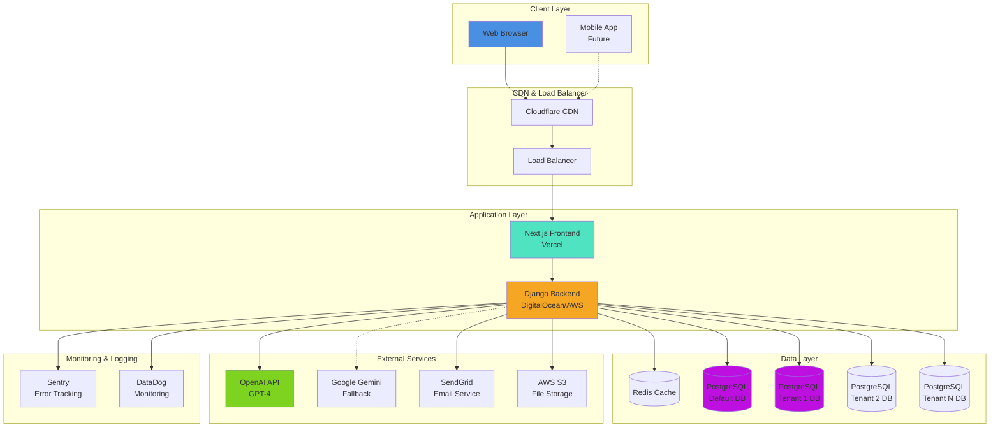

---

## 2. Multi-Tenant Architecture

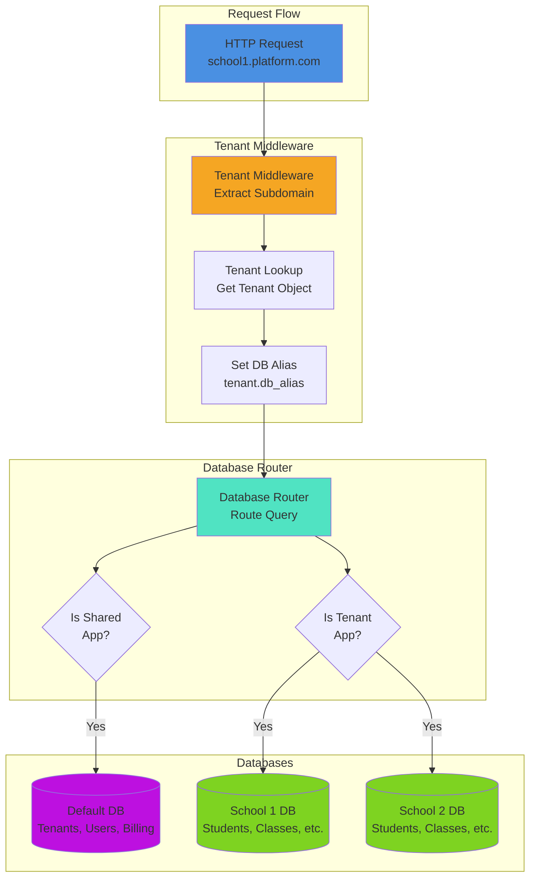

---

## 3. Authentication Flow

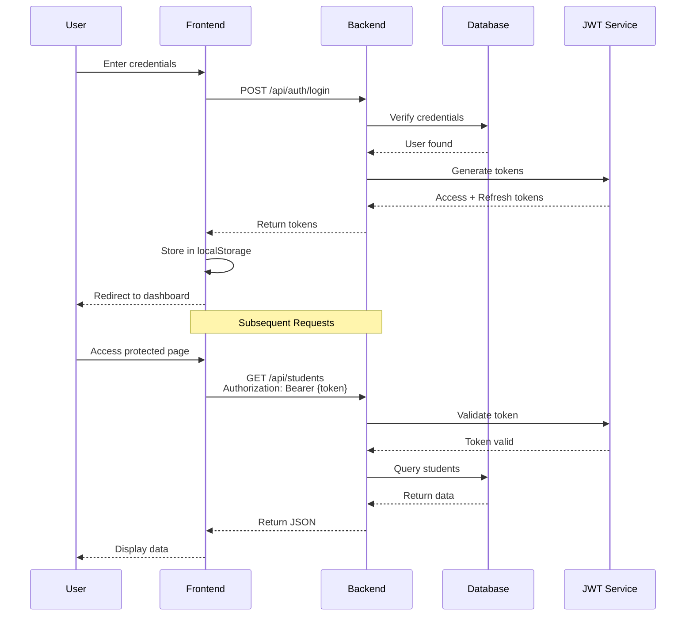

---

## 4. Multi-Tenant Request Flow

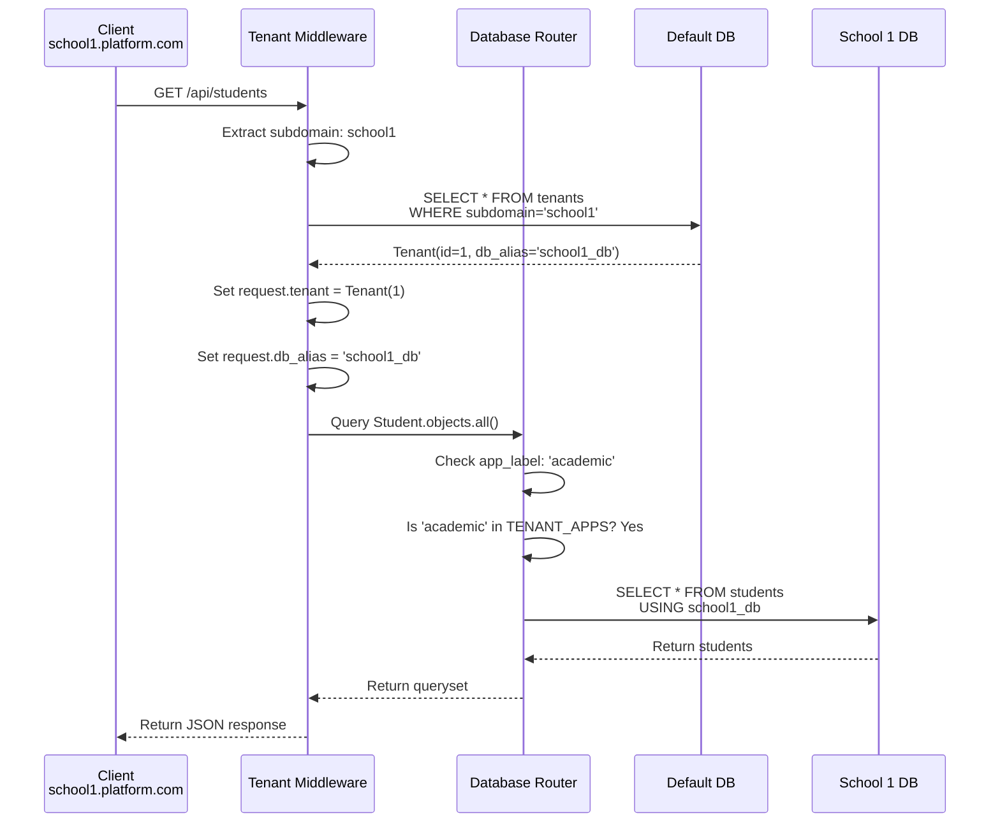

---

## 5. AI Integration Architecture

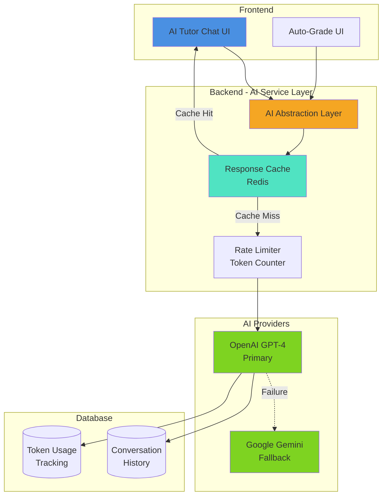

---

## 6. Data Model (Core Entities)

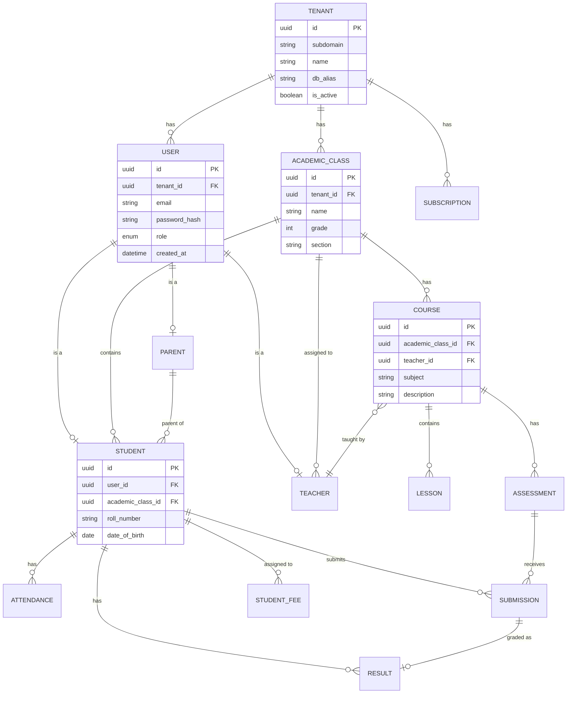

---

## 7. API Architecture

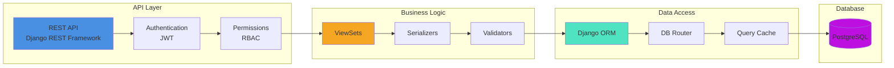

---

## 8. Frontend Architecture

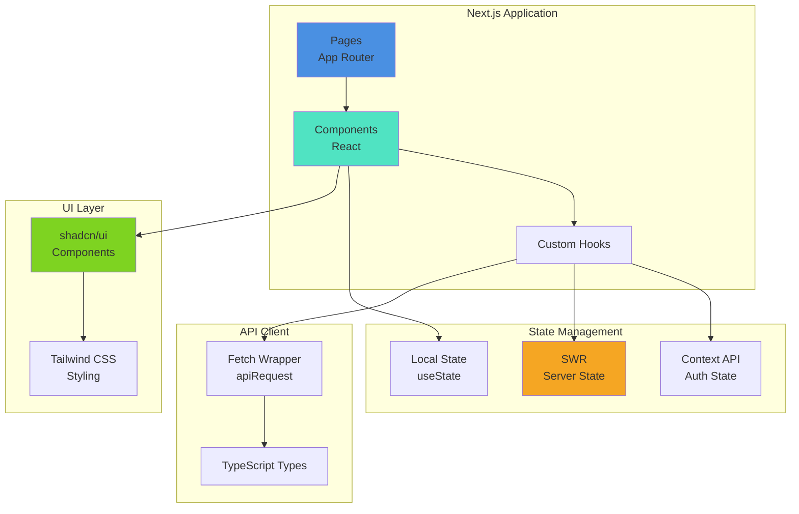

---

## 9. Deployment Architecture

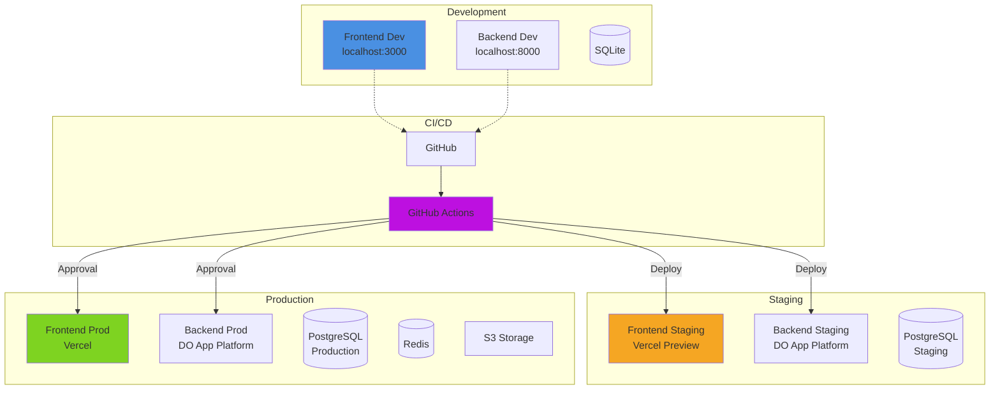

---

## 10. Security Architecture

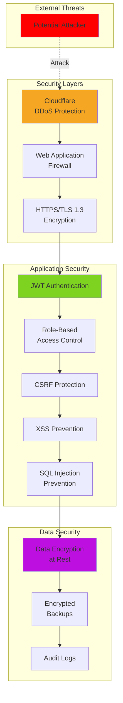

---

## 11. CI/CD Pipeline

```mermaid
graph LR
    subgraph "Developer"
        CODE[Write Code]
        COMMIT[Git Commit]
        PUSH[Git Push]
    end

    subgraph "GitHub Actions"
        LINT[Lint Check<br/>ESLint, Black]
        TEST[Run Tests<br/>Jest, Pytest]
        BUILD[Build<br/>Docker Images]
        SCAN[Security Scan<br/>Snyk]
    end

    subgraph "Deployment"
        STG[Deploy to<br/>Staging]
        SMOKE[Smoke Tests]
        APPROVE[Manual<br/>Approval]
        PROD[Deploy to<br/>Production]
    end

    CODE --> COMMIT
    COMMIT --> PUSH
    PUSH --> LINT
    LINT --> TEST
    TEST --> BUILD
    BUILD --> SCAN
    SCAN --> STG
    STG --> SMOKE
    SMOKE --> APPROVE
    APPROVE --> PROD

    style CODE fill:#4A90E2
    style TEST fill:#F5A623
    style SCAN fill:#FF6B6B
    style PROD fill:#7ED321
```

---

## 12. Monitoring & Observability

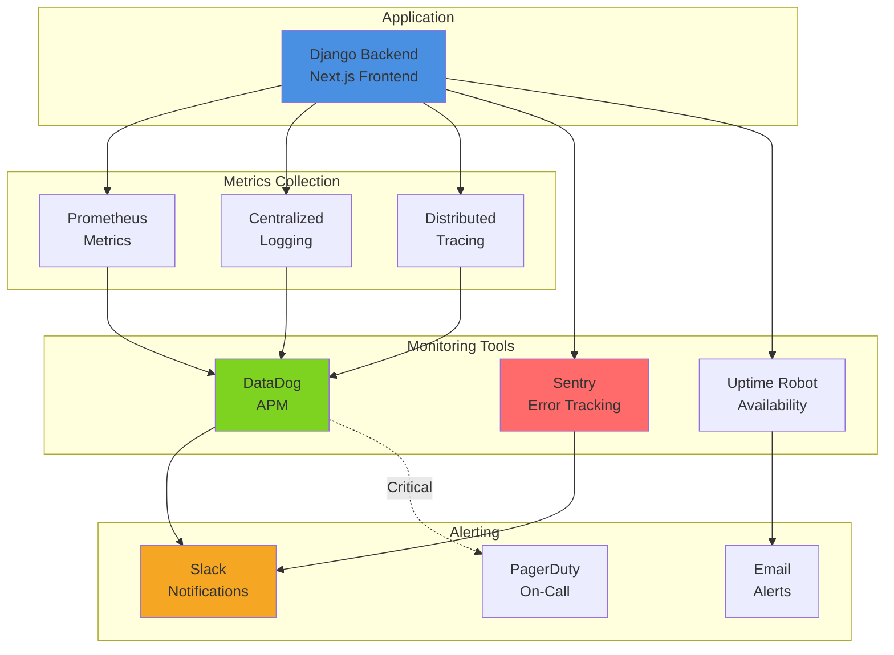

---

## How to View These Diagrams

### Option 1: GitHub (Recommended)
1. Push this file to your GitHub repository
2. View it on GitHub - diagrams will render automatically

### Option 2: VS Code
1. Install "Markdown Preview Mermaid Support" extension
2. Open this file in VS Code
3. Press `Cmd+Shift+V` (Mac) or `Ctrl+Shift+V` (Windows)

### Option 3: Mermaid Live Editor
1. Go to https://mermaid.live
2. Copy and paste any diagram code
3. View and export as PNG/SVG

### Option 4: Generate Images
```bash
# Install mermaid-cli
npm install -g @mermaid-js/mermaid-cli

# Generate PNG images
mmdc -i architecture-diagrams.md -o diagrams/
```

---

## Diagram Descriptions

### 1. System Architecture
Shows the complete system with all layers: client, CDN, application, data, external services, and monitoring.

### 2. Multi-Tenant Architecture
Illustrates how tenant isolation works with database-per-tenant approach.

### 3. Authentication Flow
Sequence diagram showing login and subsequent authenticated requests.

### 4. Multi-Tenant Request Flow
Detailed sequence of how a request is routed to the correct tenant database.

### 5. AI Integration Architecture
Shows how AI features are integrated with caching and fallback mechanisms.

### 6. Data Model
Entity-relationship diagram of core database entities.

### 7. API Architecture
Layers of the REST API from request to database.

### 8. Frontend Architecture
Next.js application structure with state management and UI layers.

### 9. Deployment Architecture
Development, staging, and production environments with CI/CD flow.

### 10. Security Architecture
Multiple layers of security from external threats to data protection.

### 11. CI/CD Pipeline
Automated pipeline from code commit to production deployment.

### 12. Monitoring & Observability
How the application is monitored and alerts are sent.

---

**Document Owner**: Technical Lead  
**Last Updated**: January 19, 2026  
**Review Cycle**: Quarterly or when architecture changes
