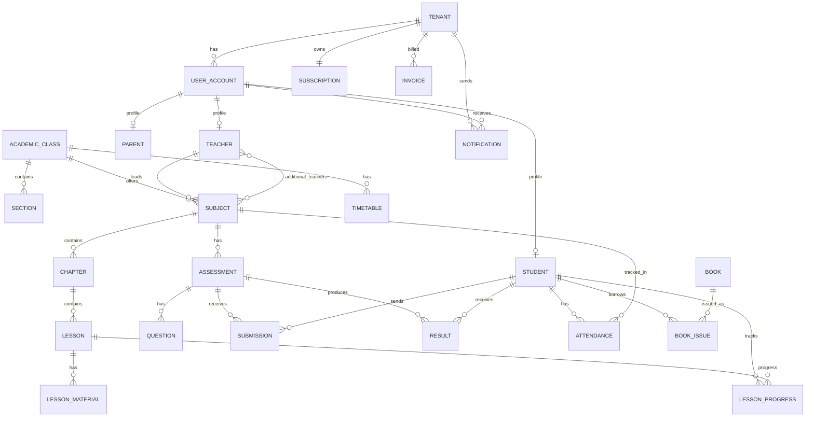

# Database Design Used in E-LearningWebApp
## Actual Data Model and Tenant Boundaries

**Last verified:** March 4, 2026

This document reflects the real models currently present in backend code.

## 1. Tenant and Schema Design Used

### 1.1 Multi-Tenant DB Pattern
- Package: `django-tenants`
- Strategy: schema-per-tenant on PostgreSQL.
- `TENANT_MODEL = core.Tenant`
- `TENANT_DOMAIN_MODEL = core.Domain`
- Router: `django_tenants.routers.TenantSyncRouter`
- Middleware: `TenantFromHeaderMiddleware` resolves tenant from `x-tenant-id` or domain.

### 1.2 Shared vs Tenant Apps (Current)
From `backend/config/settings/base.py`:
- Shared apps include: `core`, `billing`, `users`, `gamification`, and framework apps.
- Tenant apps include: `users`, `academic`, `billing`, `ai_engine`, `reports`, `notifications`, `library`, `gamification`, `conversations`.

Note: `users`, `billing`, and `gamification` appear in both shared and tenant app sets (hybrid behavior).

## 2. Core Identity and Tenant Tables

### 2.1 `core_tenant`
Key fields:
- `schema_name` (from `TenantMixin`)
- `name`, `subdomain`, `type`, `status`
- profile fields (`address`, `contact_email`, etc.)
- `features` JSON

### 2.2 `core_domain`
Maps host/domain to tenant.

### 2.3 `users_useraccount`
Primary key: `user_id` (UUID)
Core fields:
- `email` (unique login field)
- `username`
- `role` enum
- `tenant` FK (`core.Tenant`)
- profile and optional 2FA fields

## 3. Academic Domain Tables (Tenant Scope)

### 3.1 Structural Hierarchy
- `AcademicYear`
- `AcademicClass`
- `Section` (`Section.academic_class -> AcademicClass`)
- `Teacher` (`Teacher.user -> users.UserAccount`)
- `Student` (`Student.user -> users.UserAccount`, class/section links)
- `Parent` (`Parent.user`, M2M with students)
- `Subject` (`Subject.academic_class`, lead `teacher`, M2M `additional_teachers`)

### 3.2 Learning Content
- `Chapter` -> `Subject`
- `Lesson` -> `Chapter`
- `LessonMaterial` -> `Lesson`
- `LessonProgress` -> (`Student`, `Lesson`) unique pair

### 3.3 Assessments and Exams
- `Assessment` -> `Subject`, optional `Section`
- `Question` -> `Assessment`
- `Submission` -> (`Assessment`, `Student`) unique pair
- `Result` -> (`Assessment`, `Student`)
- `Exam` (1:1 with assessment of type exam)
- `ExamSeating` -> (`Exam`, `Student`) unique pair

### 3.4 Operations
- `Attendance` unique by (`student`, `subject`, `date`)
- `Timetable` with indexes and constraint `end_time > start_time`
- `Notice` targeted by school/class/student

## 4. Billing and Finance Tables

### 4.1 SaaS Billing
- `SubscriptionPlan`
- `Subscription` (1:1 with `Tenant`)
- `SubscriptionPlanHistory`
- `Invoice`

### 4.2 School Finance
- `FeeStructure` (tenant and optional class)
- `StudentFee` (tenant, student, fee structure)
- `Payment` (tenant, student, optional student_fee)
- `Expense` (tenant-level cost tracking)

## 5. Library Tables
- `Book` (catalog with unique ISBN constraint when ISBN is non-null)
- `BookIssue` (`book`, `student`) with issue/return lifecycle and availability updates

## 6. AI, Notification, Conversation, Gamification Tables

### 6.1 AI
- `AIInteractionLog` (tenant/user token usage)
- `StudentAIReport`
- `LearningPath` / `LearningNode`
- `StudyEvent`

### 6.2 Notifications
- `Notification`
- `NotificationTemplate`

### 6.3 Conversations
- `Conversation`
- `ConversationParticipant` (unique by conversation+user)
- `Message`

### 6.4 Gamification
- `Badge`
- `StudentBadge` (unique by student+badge)
- `PointTransaction`
- `GamificationProfile` (1:1 by student)

## 7. Core Supporting Tables
- `AuditLog`
- `GlobalSettings` (singleton pattern)

## 8. Relationship View (Condensed ERD)


## 9. Migration and Change Workflow Used
Recommended commands in this project:
```bash
cd backend
python manage.py migrate_schemas --shared --noinput
python manage.py migrate_schemas --schema=public --noinput
python manage.py migrate_schemas --tenant --noinput
```

Production init command used by deploy scripts:
```bash
python manage.py init_prod
```

## 10. Data Design Notes and Constraints
- Many tenant-linked FKs use `db_constraint=False` to avoid cross-schema FK enforcement issues.
- Data isolation is primarily controlled by schema routing and tenant middleware.
- UI/API should normalize list payloads because some endpoints return paginated objects and others arrays.

