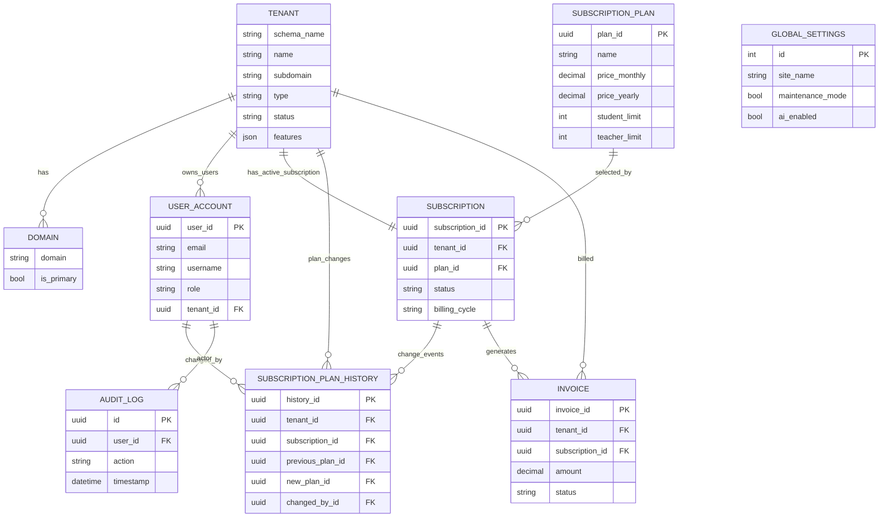
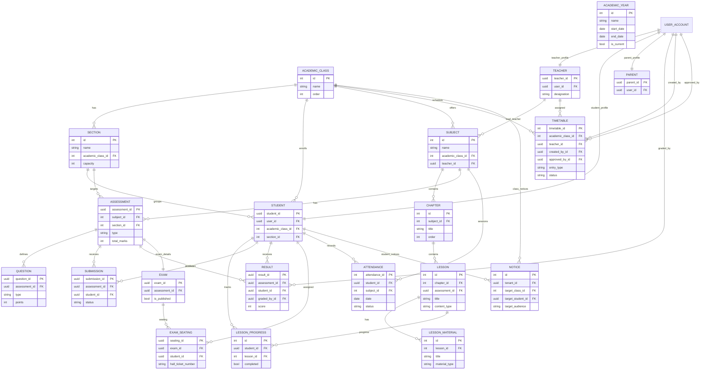
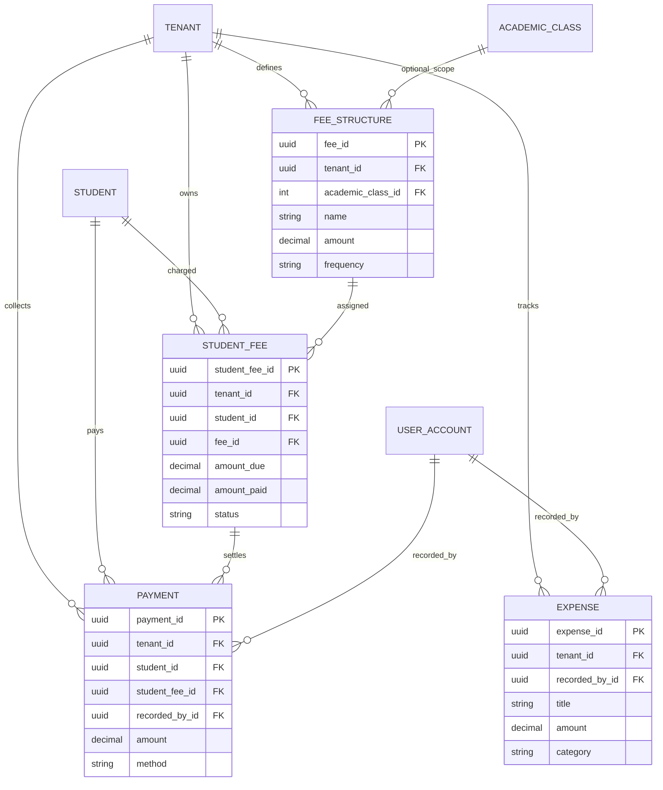

# Database ER Diagrams (Used in This Project)
## E-LearningWebApp - Model Relationships from Current Codebase

**Last verified:** March 4, 2026  
**Source:** `backend/*/models.py`

This document provides readable ER diagrams of the database design currently used by this project.

## 1) Core Identity + Tenancy + SaaS Billing

## 2) Academic Domain (LMS Core)

## 3) School Finance (Tenant-Level)

## 4) Library + AI + Notifications + Conversations + Gamification

```mermaid
erDiagram
    BOOK {
        uuid book_id PK
        string title
        string author
        string isbn
        int total_copies
        int available_copies
    }

    BOOK_ISSUE {
        uuid issue_id PK
        uuid book_id FK
        uuid student_id FK
        date due_date
        string status
    }

    AI_INTERACTION_LOG {
        uuid log_id PK
        uuid tenant_id FK
        uuid user_id FK
        string feature_used
        int total_tokens
    }

    STUDENT_AI_REPORT {
        uuid report_id PK
        uuid tenant_id FK
        uuid student_id FK
    }

    LEARNING_PATH {
        uuid id PK
        uuid tenant_id FK
        uuid student_id FK
        int subject_id FK
        string title
    }

    LEARNING_NODE {
        uuid id PK
        uuid learning_path_id FK
        int lesson_id FK
        string resource_type
        string status
    }

    STUDY_EVENT {
        uuid id PK
        uuid tenant_id FK
        uuid student_id FK
        int subject_id FK
        datetime start_time
        datetime end_time
    }

    NOTIFICATION {
        int id PK
        uuid tenant_id FK
        uuid recipient_id FK
        string title
        bool is_read
    }

    NOTIFICATION_TEMPLATE {
        int id PK
        uuid tenant_id FK
        string name
        string type
    }

    CONVERSATION {
        uuid conversation_id PK
        uuid tenant_id FK
        string type
    }

    CONVERSATION_PARTICIPANT {
        int id PK
        uuid conversation_id FK
        uuid user_id FK
    }

    MESSAGE {
        uuid message_id PK
        uuid conversation_id FK
        uuid sender_id FK
        string content
    }

    BADGE {
        uuid id PK
        uuid tenant_id FK
        string name
        string criteria_type
    }

    STUDENT_BADGE {
        uuid id PK
        uuid tenant_id FK
        uuid student_id FK
        uuid badge_id FK
    }

    POINT_TRANSACTION {
        uuid id PK
        uuid tenant_id FK
        uuid student_id FK
        int points
    }

    GAMIFICATION_PROFILE {
        uuid id PK
        uuid tenant_id FK
        uuid student_id FK
        int current_level
        int total_xp
    }

    BOOK ||--o{ BOOK_ISSUE : issued_as
    STUDENT ||--o{ BOOK_ISSUE : borrows

    TENANT ||--o{ AI_INTERACTION_LOG : tracks
    USER_ACCOUNT ||--o{ AI_INTERACTION_LOG : performs

    TENANT ||--o{ STUDENT_AI_REPORT : generates
    STUDENT ||--o{ STUDENT_AI_REPORT : owns

    TENANT ||--o{ LEARNING_PATH : owns
    STUDENT ||--o{ LEARNING_PATH : personalized_for
    SUBJECT ||--o{ LEARNING_PATH : context

    LEARNING_PATH ||--o{ LEARNING_NODE : has
    LESSON ||--o{ LEARNING_NODE : linked_lesson

    TENANT ||--o{ STUDY_EVENT : schedules
    STUDENT ||--o{ STUDY_EVENT : assigned
    SUBJECT ||--o{ STUDY_EVENT : related_subject

    TENANT ||--o{ NOTIFICATION : emits
    USER_ACCOUNT ||--o{ NOTIFICATION : receives

    TENANT ||--o{ NOTIFICATION_TEMPLATE : configures

    TENANT ||--o{ CONVERSATION : owns
    CONVERSATION ||--o{ CONVERSATION_PARTICIPANT : has
    USER_ACCOUNT ||--o{ CONVERSATION_PARTICIPANT : joins
    CONVERSATION ||--o{ MESSAGE : contains
    USER_ACCOUNT ||--o{ MESSAGE : sends

    TENANT ||--o{ BADGE : defines
    TENANT ||--o{ STUDENT_BADGE : awards
    STUDENT ||--o{ STUDENT_BADGE : earns
    BADGE ||--o{ STUDENT_BADGE : awarded_badge

    TENANT ||--o{ POINT_TRANSACTION : logs
    STUDENT ||--o{ POINT_TRANSACTION : earns_points

    TENANT ||--o{ GAMIFICATION_PROFILE : owns
    STUDENT ||--|| GAMIFICATION_PROFILE : profile
```

## Notes
- These diagrams reflect model-level relationships in code, not every database constraint/index.
- Some FKs use `db_constraint=False` intentionally for multi-tenant routing compatibility.
- For migrations and tenant schema operations, use commands documented in `database-design-used.md`.

