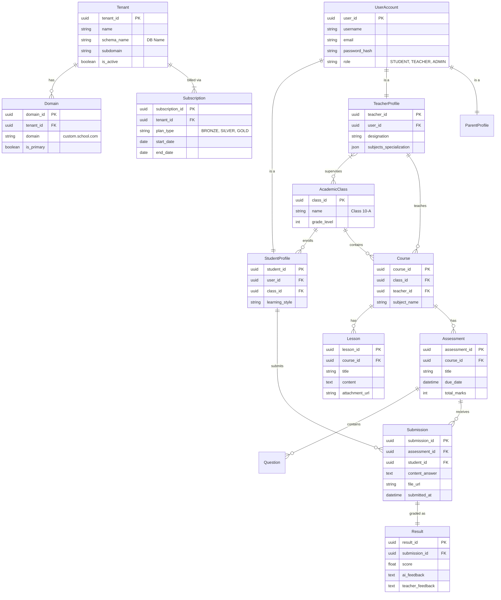

# Database Design & ER Diagram

## 1. Database Strategy: Hybrid Multi-Tenancy
The platform uses a **Database-per-Tenant** architecture to ensure strict data isolation, scalability, and security.

- **Shared Database (`default`)**: Stores global configuration, tenant routing info, and SaaS billing data.
- **Tenant Databases (`school_xyz`)**: Stores all operational data for a specific educational institution (Users, Classes, Grades, Content).

---

## 2. Entity-Relationship (ER) Diagram

### Concept
The diagram below illustrates the logical flow. Note that **Shared** and **Tenant** tables reside in physically separate databases (or schemas), so there are no database-level Foreign Keys between them. The application handles the routing.

---

## 3. Schema Definitions

### A. Shared Database Schemas
These tables exist **once** in the main database.

| Table | PK | Description |
| :--- | :--- | :--- |
| `core_tenant` | `tenant_id` | Registry of all schools. Contains DB connection info. |
| `core_domain` | `domain_id` | DNS mapping for custom domains. |
| `billing_invoice` | `invoice_id` | Generated invoices for SaaS subscription fees. |
| `users_useraccount` | `user_id` | **Global Superadmins** only (SaaS Staff). |

### B. Tenant Database Schemas
These tables are replicated in **every** tenant database (`school_a`, `school_b`, etc.).

#### 1. User Management (`users` app)
- **`UserAccount`**: The custom Auth model.
    - Fields: `username`, `email`, `role`, `is_active`.
    - Roles: `school_admin`, `teacher`, `student`, `parent`.

#### 2. Academic Management (`academic` app)
- **`AcademicClass`**: Represents a physical class division (e.g., "Grade 5, Section B").
- **`Student`**: Extends User. Contains learning stats, streak, focus score. Linked to `AcademicClass`.
- **`Teacher`**: Extends User. Contains designation. Can be assigned multiple courses.

#### 3. Content Delivery (`academic` app)
- **`Course`**: Subject within a class (e.g., "Grade 5 Math"). Linked to a Teacher.
- **`Lesson`**: Instructional content (Text, Video Links, PDFs).
- **`Assessment`**: Quizzes or uploads. Supports AI auto-grading metadata.

#### 4. AI Engine (`ai_engine` app)
- **`AIInteractionLog`**: Tracks token usage per user for billing and auditing.
    - Fields: `user_id`, `prompt_tokens`, `completion_tokens`, `feature_used` (Tutor/Grader).

---

## 4. Key Design Decisions

### Why No Foreign Keys between Shared and Tenant DBs?
Most relational databases (PostgreSQL, MySQL) do not support Foreign Keys across different databases.
- **Solution**: The application logic enforces relationships. For example, the `TenantMiddleware` ensures that when a request comes in for `school-a.com`, only the `school_a` database is accessed.

### UUIDs for Primary Keys
We use **UUIDv4** for all Primary Keys (`id`).
- **Benefit**: Globally unique IDs prevent collisions if we ever need to merge databases or migrate data. It also prevents ID enumeration attacks (scanning `user/1`, `user/2`, etc.).

### JSON Fields for Flexibility
We leverage PostgreSQL's `JSONB` fields for:
- `Question.options`: Storing MCQ options without a separate table.
- `Teacher.subjects`: Storing a list of subjects without a complex many-to-many table for simple logic.
- `AIInteractionLog.meta`: Storing arbitrary metadata about the AI prompt context.
